# CNC AI Quotation Generator

A professional CNC machining cost estimation platform that automatically generates quotations from CAD files. Processes DXF files, extracts geometry information, calculates machining costs, and generates professional PDF quotations with AI-powered optimization recommendations.

---

## 📋 Table of Contents

1. [Features](#-features)
2. [Installation](#-installation)
3. [Quick Start](#-quick-start)
4. [System Architecture](#-system-architecture)
5. [Algorithms Used](#-algorithms-used)
6. [Configuration](#-configuration)
7. [Project Structure](#-project-structure)

---

## 🚀 Features

### Core Functionality
- **DXF File Processing**: Parse and extract geometry from DXF files
- **Geometry Analysis**: Extract lines, arcs, circles, polylines, splines, ellipses
- **Material Database**: Support for 6 materials (steel, aluminum, plastic, wood, brass, copper)
- **Cost Calculation**: Automated cost and time estimation
- **PDF Generation**: Professional quotation documents
- **Complexity Scoring**: Automatic complexity analysis (0-100 scale)

### AI-Powered Features
- **Material Recommendations**: AI-suggested alternatives with cost analysis
- **Path Optimization**: TSP-based cutting path optimization
- **Nesting Optimization**: Optimal part arrangement on material sheets
- **Design Suggestions**: AI-powered manufacturability improvements
- **Manufacturing Insights**: Expert recommendations

### Interactive Features
- **Real-time Visualization**: Canvas-based path and nesting visualizations
- **Interactive Charts**: Entity distribution and layer statistics
- **Modern UI**: Responsive dashboard
- **Async Loading**: Fast page loads with background AI processing

---

## 🛠️ Installation

### Prerequisites
- Python 3.8 or higher
- pip package manager

### Setup Steps

1. **Clone or download the project**
   ```bash
   cd CAD
   ```

2. **Create virtual environment (recommended)**
   ```bash
   # Windows
   python -m venv venv
   venv\Scripts\activate

   # macOS/Linux
   python3 -m venv venv
   source venv/bin/activate
   ```

3. **Install dependencies**
   ```bash
   pip install -r requirements.txt
   ```

4. **Set up environment variables (optional - for AI features)**
   
   Create `.env` file:
   ```env
   # For OpenRouter (Recommended - Free AI models)
   USE_OPENROUTER=true
   OPENROUTER_API_KEY=sk-or-v1-your-key-here
   OPENROUTER_MODEL=meta-llama/llama-3.2-3b-instruct:free

   # Or for OpenAI
   OPENAI_API_KEY=your-openai-key-here
   OPENAI_MODEL=gpt-3.5-turbo
   ```

5. **Run the application**
   ```bash
   python app.py
   ```

6. **Access the application**
   ```
   http://localhost:5000
   ```

---

## 🎯 Quick Start

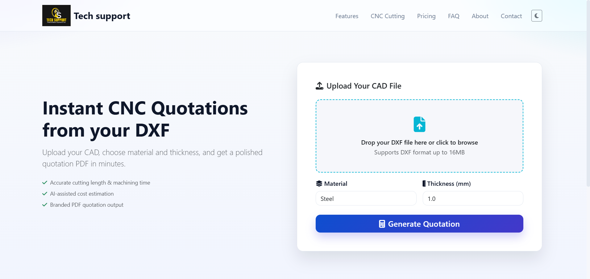

### Basic Workflow

1. **Upload DXF File**
   - Drag and drop or click to browse
   - Select a `.dxf` file (max 16MB)

2. **Select Material & Thickness**
   - Choose material type
   - Enter thickness in millimeters
   - 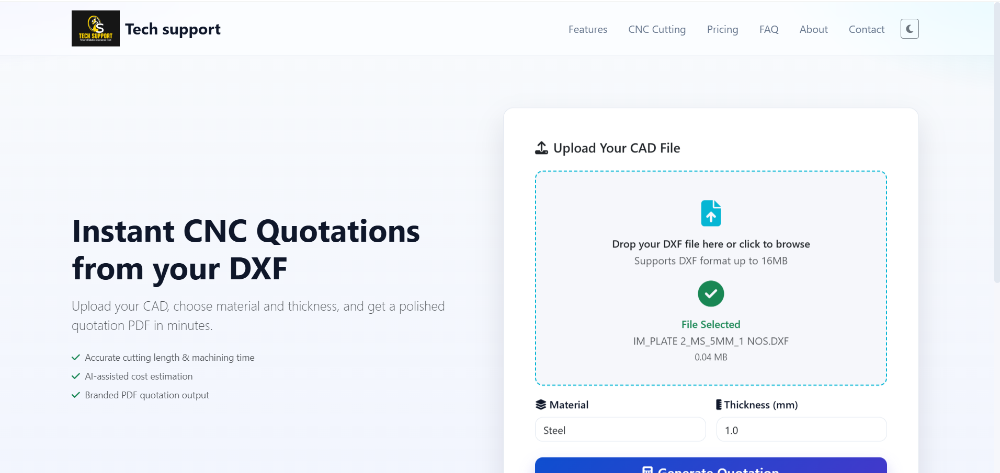

3. **Generate Quotation**
   - Click "Generate Quotation"
   - Wait for processing
   - 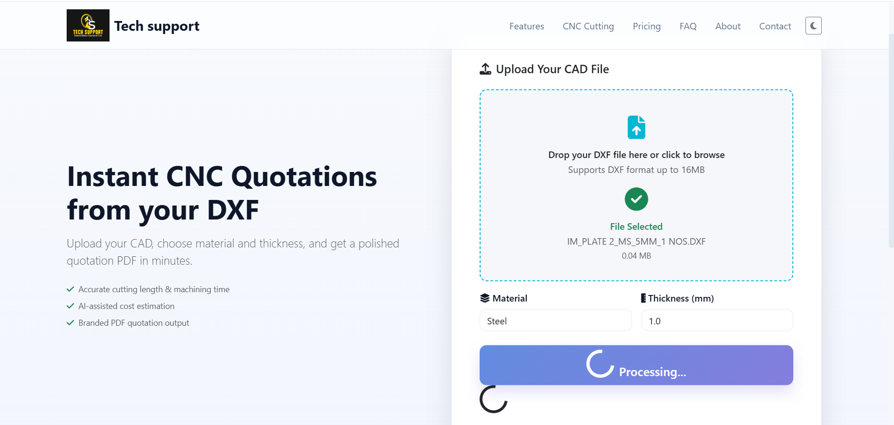

4. **View Results**
   - Review geometry analysis
   - Check cost breakdown
   - View AI recommendations
   - 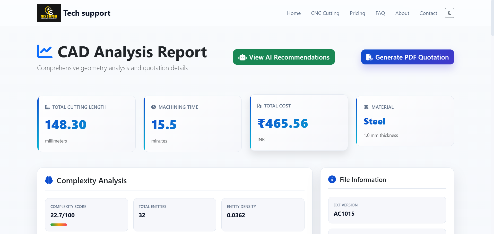

5. **Download PDF**
   - Click "Generate PDF Quotation"
   - Professional quotation downloads
   - 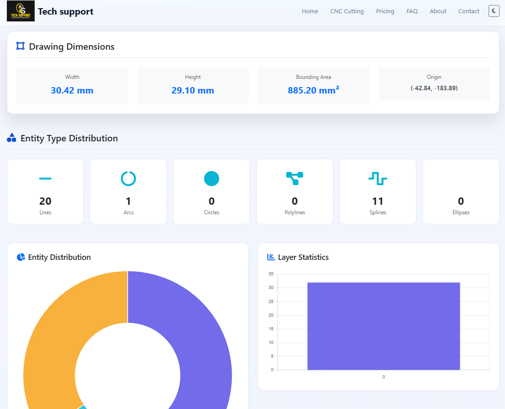

---

## 🏗️ System Architecture

```
┌─────────────┐
│ Web Browser │
└──────┬──────┘
       │
       ▼
┌─────────────┐
│  Flask App  │ ← app.py
└──────┬──────┘
       │
   ┌───┴───┬──────────┬──────────┬──────────┐
   ▼       ▼          ▼          ▼          ▼
┌──────┐ ┌──────┐ ┌──────┐ ┌──────┐ ┌──────┐
│  CAD │ │ Cost │ │ PDF  │ │  AI  │ │Path/ │
│Proc. │ │Calc. │ │Gen.  │ │Advis.│ │Nest. │
└──────┘ └──────┘ └──────┘ └──────┘ └──────┘
```

### Module Responsibilities

| Module | Purpose |
|--------|---------|
| `app.py` | Flask web server, routing, request handling |
| `cad_processor.py` | DXF parsing, geometry extraction |
| `cost_calculator.py` | Cost and time estimation |
| `pdf_generator.py` | Professional PDF generation |
| `ai_advisor.py` | AI-powered recommendations |
| `path_optimizer.py` | TSP path optimization |
| `nesting_optimizer.py` | Material sheet nesting |

---

## 🧮 Algorithms Used

### 1. Complexity Score Algorithm
- **Purpose**: Quantify manufacturing complexity (0-100 scale)
- **Factors**: Entity count, diversity, layer count, curve complexity, size, density
- **Location**: `cad_processor.py` → `_calculate_complexity_score()`

### 2. TSP Path Optimization
- **Algorithm**: Nearest Neighbor with 2-opt improvement
- **Purpose**: Minimize cutting path travel distance
- **Time Complexity**: O(n²)
- **Location**: `path_optimizer.py` → `_nearest_neighbor_tsp()`

### 3. Nesting Optimization
- **Algorithm**: Grid-based bin packing
- **Purpose**: Maximize material utilization
- **Location**: `nesting_optimizer.py` → `calculate_optimal_nesting()`

### 4. Cost Calculation
- **Components**: Material cost, labor cost, setup cost, GST (18%)
- **Location**: `cost_calculator.py`

### 5. Entity Length Calculations
- **Line**: Euclidean distance
- **Arc**: Radius × angle difference
- **Circle**: 2π × radius
- **Polyline**: Sum of segment distances
- **Spline**: Point sampling approximation
- **Ellipse**: Ramanujan's approximation
- **Location**: `cad_processor.py`

---

## 🔧 Core Functionalities

### DXF File Processing

- Parses DXF files using `ezdxf` library
- Extracts geometric entities (lines, arcs, circles, polylines, splines, ellipses)
- Calculates dimensions and measurements
- Generates bounding box and complexity metrics

### Geometry Analysis


- Bounding box calculation
- Complexity scoring (0-100)
- Entity breakdown by type
- Layer statistics
- Entity length calculations

### Cost Calculation

- Material cost based on cutting length and thickness
- Labor cost based on machining time and hourly rates
- Setup and tooling costs
- GST calculation (18%)
- Material-specific feed rates and pricing

### PDF Quotation Generation


- Professional header with company branding
- Executive summary boxes
- Detailed project specifications
- Technical entity breakdown
- Comprehensive cost breakdown
- Terms and conditions

---

## 🤖 AI Features

### Material Recommendations

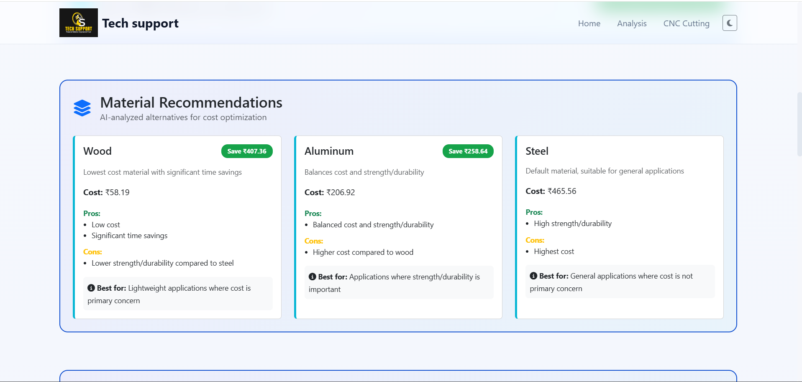

- AI analyzes geometry and suggests material alternatives
- Cost-benefit analysis
- Pros/cons for each material
- Best use cases

### Path Optimization

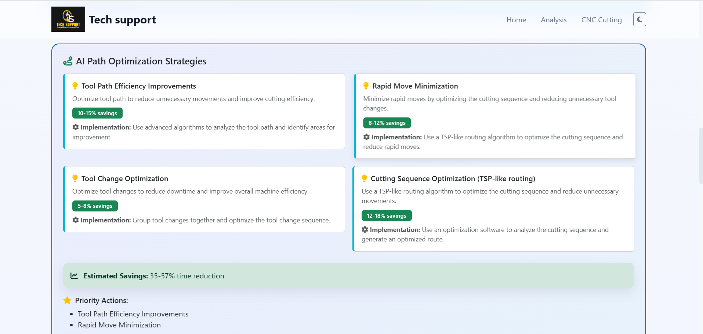
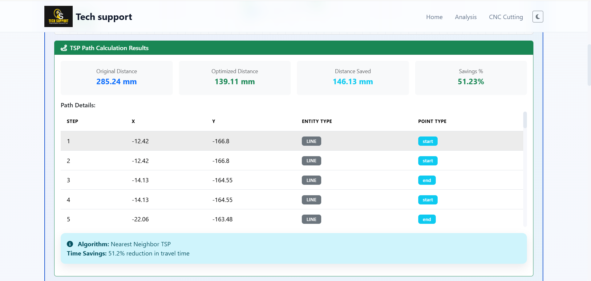


- TSP algorithm for optimal cutting sequence
- Visual path comparison
- Distance savings calculation
- Step-by-step path details

### Nesting Optimization

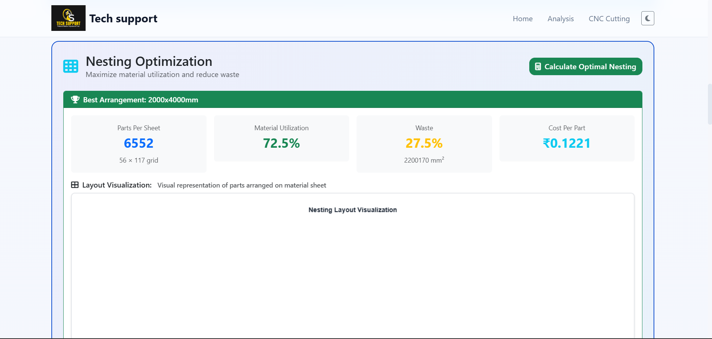
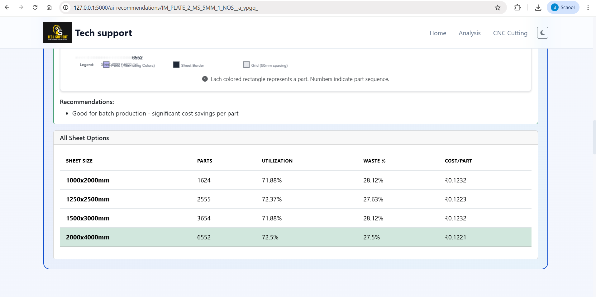

- Optimal part arrangement on material sheets
- Material utilization calculation
- Visual nesting layout
- Cost per part analysis

### Design Optimization

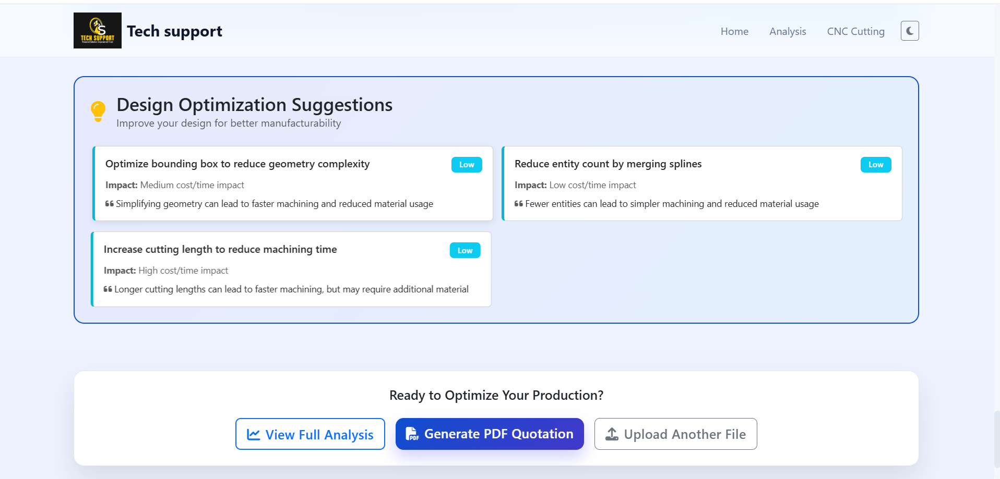

- Geometry simplifications
- Feature modifications
- Tolerance adjustments
- Manufacturing feasibility analysis

### Manufacturing Insights

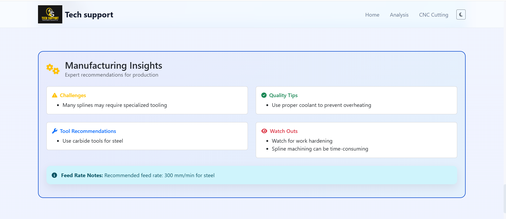

- Manufacturing challenges
- Tool recommendations
- Quality tips
- Best practices

---

## ⚙️ Configuration

### Company Information

Edit `pdf_generator.py`:

```python
self.company_name = "Your Company Name"
self.company_address = "Your Address"
self.company_phone = "+91-XXXXXXXXXX"
self.company_email = "info@yourcompany.com"
```

### Material Properties

Edit `cost_calculator.py`:

```python
self.material_costs = {
    'steel': 0.0065,      # ₹ per cm³
    'aluminum': 0.0200,
    # Add/modify as needed
}

self.machine_rates = {
    'steel': 1800.0,      # ₹ per hour
    'aluminum': 1600.0,
    # Add/modify as needed
}
```

### AI Configuration

Edit `.env` file:

```env
USE_OPENROUTER=true
OPENROUTER_API_KEY=your-key-here
OPENROUTER_MODEL=meta-llama/llama-3.2-3b-instruct:free
```

---

## 📁 Project Structure

```
CAD/
├── app.py                      # Main Flask application
├── cad_processor.py            # DXF processing & geometry extraction
├── cost_calculator.py          # Cost & time calculation
├── pdf_generator.py            # PDF quotation generation
├── ai_advisor.py              # AI-powered recommendations
├── path_optimizer.py         # TSP path optimization
├── nesting_optimizer.py        # Material sheet nesting
├── requirements.txt            # Python dependencies
├── .env                        # Environment variables (create this)
├── templates/                  # HTML templates
│   ├── index.html
│   ├── features.html
│   └── ai_recommendations.html
├── static/                    # Static assets
│   ├── css/styles.css
│   └── js/app.js
├── screenshots/               # Screenshots for documentation
└── temp_pdfs/                 # Generated PDFs
```

---

## 🔍 Troubleshooting

### Common Issues

**Module not found**
```bash
pip install -r requirements.txt
```

**Port 5000 already in use**
- Change port in `app.py`: `app.run(port=5001)`

**DXF file not processing**
- Verify file is valid DXF format
- Check file size (max 16MB)
- Ensure file opens in CAD software

**AI recommendations not loading**
- Check `.env` file exists
- Verify API key is correct
- Check internet connection

**PDF generation fails**
```bash
pip install --upgrade reportlab
```

---

## 📄 License

This project is open source and available under the MIT License.

---

**Built for the CNC manufacturing community**


